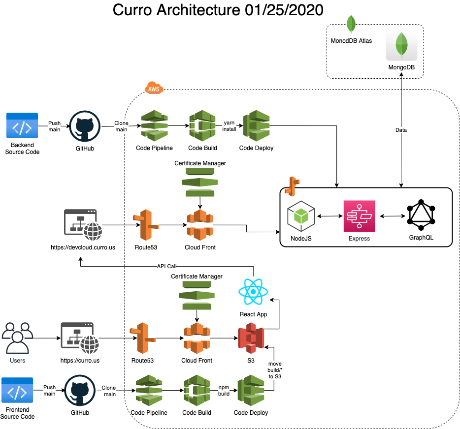

# Curro Frontend
Curro Activty Tracker is a website where athletes can come together as teams or indiduals to log there exercises with a note to share with everyone in their network. You can visit the website at https://curro.us

Development version can be seen at http://dev-curro.s3-website-us-east-1.amazonaws.com

## Getting Started
Clone the project
`git clone`

Install packages
`npm install`

Run Create React App
`npm start`

## Architecture

  

 
